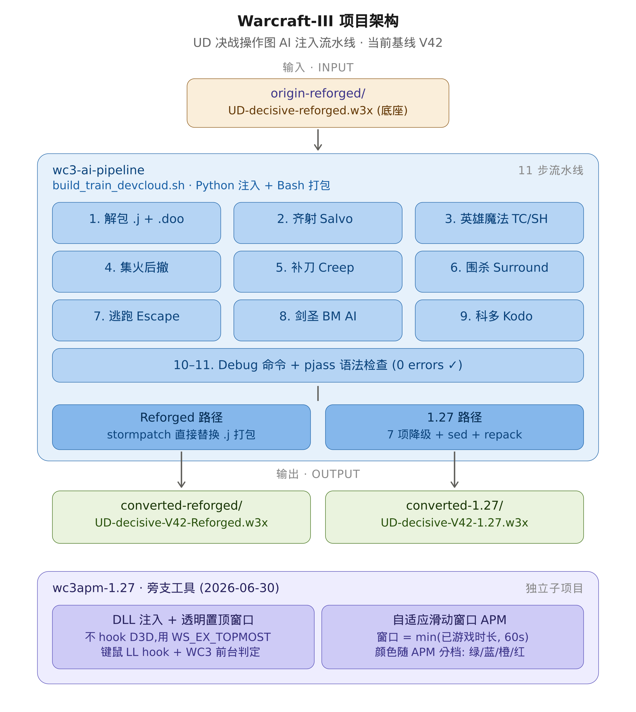

# UD 决战操作图 — AI 注入流水线




## 当前基线版本：V47

V47 引入动态补刀系统——用实测爆发伤害代替硬编码 HP=120 阈值，4 状态机（FARMING/APPROACH/FAKE/ALL-IN）控制补刀节奏。

- **防围杀逃跑（Escape）**：先知/英雄被围时自动选方向逃跑，避树避障，树旁不停止
- **围杀（Surround）**：DK 围杀微操
- **动态补刀（V47 Creep）**：扫描野怪周围敌方近战单位，动态计算补刀阈值
- **剑圣 AI（BM）**：疾风步突进 + 智能猎杀残血英雄
- **远程齐射 + 集火后撤**：远程单位集火 + TC 践踏
- **三种 Round 1 模式互斥切换**：`-escape` / `-surround` / `-creep`
- **Combat_AI 选择性 guard**：只截断全军攻击指令，保留农民造塔和单位生产

## 一键流水线（主入口）

```bash
cd /data/ufo/Warcraft-III/wc3-ai-pipeline/
./build_train_devcloud.sh <input.w3x> <output-prefix>
```

产出两个版本：
- `<prefix>-Reforged.w3x` — 重制版（可在重制版客户端打开）
- `<prefix>-1.27.w3x` — 1.27 兼容版（可在 1.27 整合包打开）

## 9 步注入流水线 & 对应脚本

| 步骤 | 功能 | 脚本 | 游戏内命令 |
|---|---|---|---|
| 1 | 解包 war3map.j | — | — |
| 2 | 远程齐射 | `inject_salvo.py` | — |
| 3 | 暗影猎手（Hex/治疗波） | `inject_ai_shaman.py` | — |
| 3.5 | TC 智能践踏 | `inject_ai_tc_stomp.py` | — |
| 4 | 集火后撤保护 | `inject_ai_focus_retreat.py` | — |
| 5 | 补刀 / 防补刀（Round 1） | `inject_ai_creep_control.py` | `-creep` |
| 6 | 围杀（Round 1） | `inject_ai_surround.py` | `-surround` |
| 7 | 防围杀逃跑（Round 1） | `inject_ai_escape.py` | `-escape` |
| 8 | 剑圣逃脱（BM） | `inject_ai_blademaster.py` | — |
| 9 | 科多兽吞噬后撤 | `inject_ai_kodo.py` | — |
| 10 | Debug 开关 + APM/性能监控 | `inject_debug.py` | `-debug` |
| 11 | 卡位（Body Block, Round 1） | `inject_ai_body_block.py` | `-block` |
| 9 | pjass 语法检查 + 打包 | — | — |


## V47 动态补刀系统（2026-07-07）

### 核心思路

不再写死 HP=120 阈值，改为**动态扫描野怪周围敌方近战单位，按实测爆发伤害计算补刀阈值**。

### 实测伤害数据（重甲，1 甲食人魔）

| 单位 | 面板攻击 | 实测区间 | 取上限 |
|------|:------:|:------:|:---:|
| DK (Udea) | 25-35 | 24~33 | 33 |
| 食尸鬼 (u006/ugho) | 12-14 | 11~13 | 13 |
| 骷髅 (uske) | 14-15 | 13~15 | 15 |

### 扫描方式

GetUnitsOfPlayerAndTypeId 按类型分别枚举（不依赖视野），IsUnitInRange(150yd) 过滤。
自定义食尸鬼 u006 已加入白名单。

### 阈值计算

burst_max = dk*33 + dog*13 + skel*15
threshold = burst_max * 1.15

### 4 状态机（0.3s tick）

| 状态 | 条件 | 先知行为 | 狼/大G |
|------|------|------|------|
| FARMING | HP > 250 | DK 在野怪 1000yd 内 attack DK；否则自由打 | 自由打 |
| APPROACH | threshold+40 < HP <= 250 | 走到野怪 200yd，到位后自由攻击 | 自由打 |
| FAKE | 50 < HP <= threshold+40 | stop + 100%假动作/tick + 走位 | 自由打 |
| ALL-IN | HP <= min(threshold, 50) | attack 补刀收割，0.3s re-issue | 自由打 |

### V47 关键改进

#### ALL-IN 魔免硬上限 50
- **魔免野怪**（n005/n006 等）：ALL-IN = min(burst_max * 1.15, 50)
  - 先知普攻仅 30-40 伤害，过早 ALL-IN (125 HP) 是白打
  - 50 HP 以下才出手，保证英雄一套普攻吃完
- **非魔免野怪**：ALL-IN = burst_max * 1.15，DK coil guard 125 正常生效

#### FAKE 假动作 100%
- 每 tick 必然执行假A+取消，不再 30% 随机
- 效果：英雄持续在野怪旁做攻击前摇，逼玩家先出刀
- 移除 FakeChance 全局变量

#### DK 死亡缠绕守卫
- 野怪魔免 → 正常动态阈值（不受 125 coil guard 影响）
- 野怪非魔免 + DK 蓝 ≥ 75 → 阈值强制 = 125（防 C 100 伤害抢怪）

### 配套改动

- Round1 排除先知 (Ofar) 从 Combat_AI dispatch
- AllInCB/ApproachCB 只处理英雄
- 野怪死后跳过后续 scan
- Debug: CREEP scan DK=N dog=N skel=N burst=N


## Round 1 模式体系（V40 核心设计）

三种模式**互斥**，通过聊天命令切换，`Round1Mode` 变量控制：

| 命令 | Round1Mode | 说明 |
|------|-----------|------|
| （默认） | 0 | 正常模式，Combat_AI 全功能运行 |
| `-surround` | 1 | 围杀模式，SurroundTick 接管英雄，Combat_AI 全军攻击被截断 |
| `-escape` | 2 | 逃跑模式，EscapeTick 接管英雄，Combat_AI 全军攻击被截断 |
| `-block` | 3 | 卡位模式，BlkTick 控制 FS 拦截 DK 移动路线 |
| `-creep` | 0 | 回到默认补刀模式 |

**模式互斥矩阵**：

| 组件 | 默认(0) | Surround(1) | Escape(2) | Block(3) |
|------|---------|------------|----------|----------|
| Combat_AI 全军攻击 | ✅ 运行 | ❌ 截断 | ❌ 截断 | ❌ 截断 |
| Combat_AI 英雄调度 | ✅ 运行 | ✅ 运行(Tick覆盖) | ✅ 运行(Tick覆盖) | ✅ 运行(Tick覆盖) |
| Combat_AI 农民造塔 | ✅ 运行 | ✅ 运行 | ✅ 运行 | ✅ 运行 |
| CreepTick | ✅ 运行 | ❌ 跳过 | ❌ 跳过 | ❌ 跳过 |
| SurroundTick | ❌ 跳过 | ✅ 运行 | ❌ 跳过 | ❌ 跳过 |
| EscapeTick | ❌ 跳过 | ❌ 跳过 | ✅ 运行 | ❌ 跳过 |

**关键设计决策（V40 踩坑总结）**：

1. **不能完全 Disable Combat_AI**：Combat_AI 包含农民造塔（hpea/opeo IssueBuildOrder）和单位调度，完全关闭会导致不出兵
2. **选择性 guard**：只截断 Combat_AI 前两行 `GroupPointOrderLocBJ("attack")`（全军攻击敌方基地），这两行会覆盖逃跑方向；其余英雄调度、农民造塔、单位指令全部保留
3. **命令立即生效**：Toggle 同时设置 `Round1Mode` + `Round1Pref`，不需要等下一轮
4. **Variable Reset 同步**：每轮开始时 `Round1Mode = Round1Pref`，保证模式跨轮持久化

## 防围杀逃跑 AI（Escape，V40 新增）

### 核心逻辑

EscapeTick 每 0.5s 执行，处理每个 AI 玩家的英雄：

1. **包围检测**：300 码内 ≥2 敌方单位 → 触发逃跑，cooldown=4 tick
2. **方向选择**：8 方向评分（避敌 + 避障 + 避树），选最低分方向
3. **树旁继续逃跑**：即使脱离包围，若 ≥2 方向 150 码内有树 + 300 码内有敌 → 继续跑
4. **卡住检测**：位移 <60 码/0.5s → stuck，自动换方向，障碍记入 memory
5. **破口攻击**：连续 stuck 5 tick → 全军集火最低血量敌人
6. **补刀**：HP<120 野怪 → 全员补刀，被围则立即退出
7. **安全时**：打野或攻击最近敌人

### 树旁继续逃跑（V40 效果最明显的优化之一）

**问题**：先知脱离包围圈后，cooldown 归零进入"安全"状态 → 停在树旁 → 敌人追上来再次被围。实测中这是**最常见的死亡场景**：逃跑方向选对了、脱离了包围，但刚好停在树林边，1-2 秒后敌人追到又被围住。

**逻辑**：脱离包围后（enemyCount300 < 2），在进入"安全"判断之前加一道检查：

1. 扫描英雄周围 8 方向 150 码处有没有树（`HasTreeAt` O(1) grid 查表）
2. 如果 **≥2 个方向** 150 码内有树，且 **300 码内有敌方单位**
3. → 视为"仍处于危险区域"，继续调用 `PickEscapeDir` 逃跑，cooldown 重置为 4 tick

**条件解读**：
- **≥2 方向有树** = 英雄被树半包围，不是孤零零一棵树
- **300 码内有敌** = 敌人还在追，不是已经甩掉了
- 两个条件同时满足才触发，不会在开阔地误触发

**实战效果**：先知不再"逃到树林边就停"，而是**持续逃跑直到远离树木**，再进入安全状态。效果非常明显，大幅减少了"脱围后被树卡住再被围杀"的情况。

### 树木避障系统

- **构建时**：从 `war3map.doo` 读取 LTlt 树坐标 → 88×43 grid array
- **运行时**：`HasTreeAt(x, y)` O(1) 查表，每 tick 8 方向 × 5 采样点 ≈ 40 次查询
- **地图参数**：CELL=128, X_MIN=-5600, Y_MIN=-3000, COLS=88, ROWS=43

### 关键参数

| 参数 | 值 | 说明 |
|------|-----|------|
| 逃跑 cooldown | 4 tick × 0.5s = 2s | 触发逃跑后持续 2 秒 |
| 包围阈值 | 300y 内 ≥2 敌人 | 触发逃跑条件 |
| 树旁条件 | ≥2 方向 150y 有树 + 300y 有敌 | 继续逃跑条件 |
| stuck 阈值 | 位移 <60y/0.5s | 卡住检测 |
| 破口阈值 | stuck 连续 5 tick (2.5s) | 集火最低血量敌人 |
| 扫描范围 | 500y，步长 100y（5 采样点/方向）| PickEscapeDir |
| 障碍 memory | 最多 100 点，100y 去重 | 动态记录卡住位置 |

## Timer 架构

各模块使用独立 timer，tick 间隔集中在 `ai_config.py` 配置：

| Timer | tick | 驱动模块 | 说明 |
|---|---|---|---|
| SalvoTick | 0.50s | 齐射 + 集火后撤 | 避免打断攻击前摇；HP 下降检测需 0.5s 窗口 |
| HeroMagic (SH_Init) | 0.10s | TC 践踏 + 暗影猎手 Hex/Heal | 快速响应施法时机 |
| CreepTick | 0.30s | 补刀 | 独立 timer，精度与平滑的折中 |
| SurroundTimerTick | 0.30s | 围杀 | 独立 timer，仅 Round1 + 围杀模式开启时生效 |
| EscapeTick | 0.50s | 防围杀逃跑 | 独立 timer，仅 escape 模式生效 |

### 围杀静止检测参数

DK 移速 ~270 码/秒，0.3s tick 下每 tick 移动 ~81 码。

| 参数 | 值 | 含义 |
|---|---|---|
| `SURROUND_STILL_THRESHOLD` | 900.0 | 平方距离阈值（30 码），低于此视为静止 |
| `SURROUND_STILL_TICKS` | 10 | 连续静止 tick 数后切换为攻击（10 × 0.3 = 3.0s） |

> **注意**：修改 `TICK_SURROUND` 后必须同步调整 still 参数，否则会误判移动中的目标为静止。

## 英雄魔法详情

### TC 战争践踏（inject_hero_magic.py）
- 自动检测范围内敌人，智能施放践踏

### 暗影猎手 AI（inject_hero_magic.py）
- **Hex**：仅对敌方 DK 施放
- **治疗波**：己方英雄单 tick HP 下降 ≥15% 时触发

### 齐射（inject_salvo.py）
- 远程单位集火目标英雄
- `'Oshd'`（暗影猎手）已从远程英雄白名单移除


## TC 智能践踏设计（inject_ai_tc_stomp.py，V17c 验证方案）

> ⚠️ **关键依赖**：底座图必须有无脑踩地板的 Func008A（即 `IssueImmediateOrderBJ(GetEnumUnit(), "stomp")`）。
> 如果没有，注入器会静默跳过，TC 不会踩。判断标准：build 日志中必须看到两条 `hooked stomp`。

### 设计原理：hook 函数体，不动调用链

底座图母调度 `ComputerXCombat_AI_Actions` 中有一行：

```
call ForGroupBJ( GetUnitsOfPlayerAndTypeId(Player(0), 'Otch'), function Trig_Computer1Combat_AI_Func008A )
```

`Func008A` 原本是无脑践踏：

```
function Trig_Computer1Combat_AI_Func008A takes nothing returns nothing
    call IssueImmediateOrderBJ( GetEnumUnit(), "stomp" )
endfunction
```

注入器用正则匹配这个函数定义，保留函数名，只替换函数体：

```
function Trig_Computer1Combat_AI_Func008A takes nothing returns nothing
    // [HERO-MAGIC] replaced dumb stomp with smart logic
    call Trig_AIML_TC_Stomp_Logic(GetEnumUnit())
endfunction
```

Combat_AI_Actions 的调用链完全不变。母调度不知道内容变了，实际执行的是智能判断。

### 智能践踏判断逻辑

1. 蓝量检查：< 100 → 跳过
2. 250码内是否有敌方英雄 → 有则立刻 `IssueImmediateOrderById(tc, 852127)`
3. 没有英雄 → 数 250 码内有效敌人（排除死亡/建筑/飞行/友方），>= StompMinEnemies(=2) 才踩
4. 都不满足 → 不踩，等下次 tick（0.1s）

### 关键设计决策

- **用 raw order ID 852127 而不是字符串 "stomp"**：不同语言版本中 order string 可能不同，raw ID 全球统一
- **hook 策略是替换函数体而不是清空函数**：清空 = return = TC 永不踩。多次犯过这个错误（见 DEGRADE 坑 22）
- **TC + SH 分离**：`inject_ai_tc_stomp.py` 只处理 TC，暗影猎手由 `inject_ai_shaman.py` 独立处理，挂在同一个 `TICK_HERO_MAGIC` timer

### build 验证

出包后 build 日志必须出现：
```
[HERO-MAGIC] hooked stomp: Trig_Computer1Combat_AI_Func008A
[HERO-MAGIC] hooked stomp: Trig_Computer2Combat_AI_Func008A
```
两个都出现才算注入成功。
## 剑圣 AI 详情（inject_ai_blademaster.py，V42 更新）

> **核心突破（V39.21）**：所有攻击都先 `move` 靠近目标到 < 100 码，再 `UnitRemoveBuffs` 破隐 + `attack`。
> 之前所有版本失败的根因是：**隐身状态下直接对远处目标下 attack 指令，AI 单位会卡住不动**（详见 DEGRADE 坑 14）。
> 先靠近再攻击后，剑圣可借疾风步隐身穿过人墙突进到后排残血英雄身边再现身攻击。

### 统一状态机：0=NORMAL  1=WAIT(撤退)  2=DASH(突进攻击)
- **攻击目标**：始终是敌方血量最少的英雄（`FindLowestHpHero`）
- 每 0.1s tick 驱动（挂在 SH_Tick）

### NORMAL（safeTicks ≥ 0）
- **① EVADE（被集火）**：HP 下降 ≥ 最大血量 15%
  - 疾风步成功 → 背向敌方英雄方向撤退 600 码 → 进 WAIT
  - 疾风步 CD/没蓝 → 平 A 血最少英雄 + 进 1s 冷却
- **② HUNT（主动猎杀）**：存在残血英雄（< 2000 码，HP < 300）
  - 疾风步成功 → 进 DASH，目标 = 血最少英雄 → move 靠近
  - 疾风步 CD/没蓝 → safeTicks = -10（母调度接管 1s）

### WAIT（撤退）
- 前 3 tick（0.3s）强制撤退（min-run guard）
- 此后连续 5 tick HP 下降 ≤ 100（约安全）→ 撤退结束：
  - 疾风步还在（`GetUnitAbilityLevel(bm, 'Boro') > 0`）→ 进 DASH 突进
  - 疾风步没了 → 平 A 血最少英雄 + 进 1s 冷却

### DASH（专心突进，不检测 EVADE）
- 距目标 < 100 码 → `UnitRemoveBuffs` 破隐 → `attack` → 回 NORMAL（1s 冷却）
- 距目标 ≥ 100 码 → `move` 靠近（隐身穿身，绝不开火打断隐身）
- 目标死亡 → 回 NORMAL

### 关键实现要点
- **先靠近再攻击**：DASH 用 `move`（而非 smart/attack）靠近，保证隐身不被打断；只在 < 100 码才破隐攻击
- **破隐方式**：`UnitRemoveBuffs(bm, true, false)`（移除所有正面 buff，不依赖 rawcode；`UnitRemoveAbility` 无效）
- **疾风步暴击加成**：破隐后首次攻击自动触发疾风步暴击
- **加点顺序**：`wk > cr > ww > cr > ww > cr > ww`（疾风步优先，去掉幻像）
- **AntiCheat 禁用**（V42）：原图每 50s 清 BM 蓝量（`SetUnitManaPercentBJ(Obla, 0.00)`），注入时自动清空 `AntiCheat_Computer{1,2}_BM` 的 Actions 函数体；`AntiCheat_Player{1,2}_LastUnit`（最后单位透视）保留
- **AntiCheat 禁用**：原图每 50s 清 BM 蓝量（），V42 起注入时自动清空  函数体；（最后单位透视）保留

## 关键配置文件

| 文件 | 用途 |
|---|---|
| `ai_config.py` | 全局 tick 间隔 + 围杀参数 |
| `build_train_devcloud.sh` | 9 步注入流水线入口 |
| `_escape_grid.py` | 树木 grid 构建（从 .doo 读取） |

## 卡位 AI（Body Block, V11）

FS（先知）拦截 DK 移动路线，通过 S 形卡位持续阻碍目标移动。

### 核心参数

| 参数 | 值 | 说明 |
|------|-----|------|
| blockDist | min(dist + 50, 250) | 卡位点距离目标前方的距离，250 上限防止追丢 |
| 偏侧周期 | 3 tick (0.45s) | S 形左右交替频率 |
| 偏侧幅度 | 30 单位 | 左右偏移距离 |
| FAR 阈值 | 800 单位 | 超过此距离不操作，节省计算 |
| Tick 间隔 | 0.15s | 6.67 Hz，高频精确控制 |

### 游戏内命令

| 命令 | 功能 |
|------|------|
| `-block` | 开/关 toggle，设置 Round1Mode=3（与 creep/surround/escape 互斥） |
| `-record` | 开/关 CSV 日志记录（输出到 `save\\blk_log\\data_N.txt`） |
| `-debug` | 全局 debug 开关，开启后每 tick 显示实时 dist/blockDist |

### 数据采集与分析

卡位调试流程：

```
1. 进入游戏 → -block 开启卡位 → -record 开启记录
2. 跑图 → 结束（不需要 -noblock）
3. 从 save/blk_log/ 取出 data_*.txt 文件
4. 分析：python3 analyze_block_log.py save/blk_log/ <output_dir>/
```

### `analyze_block_log.py` 用法

```bash
python3 analyze_block_log.py <log_dir> [output_dir]
```

输出 6 面板 SVG + PNG：
1. **Distance Over Time** — 距离线图 + avg/%<150 统计
2. **Movement Trajectory** — DK(红) vs FS(蓝) 轨迹 + 卡位点(紫)
3. **Distance Distribution** — 距离分布直方图（绿<100 / 橙100-200 / 红>200）
4. **DK Facing** — 目标朝向变化
5. **S-Turn Pattern** — 偏侧切换规律
6. **Segment Stability** — 每 20 tick 平均距离柱状图

顶部横幅显示：AvgD, L20, min/max, <150 占比, 时长, FAR→MOVE tick

### 版本演进 (degrade)

| 版本 | 日期 | 改动 | 效果 |
|------|------|------|------|
| V7 | 2026-07 | 初始版：blockDist=dist+50, 侧偏4t, 偏侧30 | avg=164, <150=65% |
| V8/V8-fix | 2026-07 | facing预测 + HOLD + blockDist改公式 | ❌ 效果下降, avg=193 |
| V8-fix3 | 2026-07 | V7逻辑 + GetPlayerController | avg=205, 玩家识别修复 |
| V9 | 2026-07 | blockDist cap 250 + 侧偏3t | avg=166, <150=55-65%, ✅ 追平V7 |
| V10 | 2026-07 | 侧偏幅度30→50 | avg=157, <150=63%, 无明显提升 |
| V11 | 2026-07 | -block toggle + -record独立 + 去掉-noblock/-blockdebug + Round1Mode=3互斥 | 命令整合, 功能等价V9 |

## 文件结构

```
wc3-ai-pipeline/
  ai_config.py                ← 全局 tick 间隔 + 围杀参数配置
  build_train_devcloud.sh     ← 主入口（一键出图）
  inject_salvo.py             ← 远程齐射
  inject_hero_magic.py        ← TC践踏 + 暗影猎手 Hex/治疗波
  inject_ai_focus_retreat.py  ← 集火后撤
  inject_ai_creep_control.py  ← 补刀 / 防补刀 + CreepTick独立timer + Variable Reset
  inject_ai_surround.py       ← 围杀 + SurroundTimerTick独立timer + 模式Toggle
  inject_ai_escape.py         ← 防围杀逃跑 + 树木避障 grid
  inject_ai_blademaster.py    ← 剑圣逃脱 BM Escape AI
  inject_debug.py             ← Debug命令（-debug）+ APM/性能监控
  _escape_grid.py             ← 从 war3map.doo 构建树木 O(1) grid
  inject_ai_body_block.py     ← 卡位 AI [V11]（-block toggle + -record log）
  analyze_block_log.py        ← 卡位日志分析工具（SVG/PNG 6 面板图表）
  deprecated/                 ← 废弃脚本（仅供参考）
  tools/
    stormtool                 ← MPQ 解包
    stormpatch                ← 单文件替换打包
    pjass                     ← JASS 语法检查
    repack                    ← 重打包工具
  refs/
    common-127-clean.j        ← pjass 用
    Blizzard.j                ← pjass 用
```

## 废弃脚本说明

以下脚本**已废弃，不再使用**，保留仅供参考：

| 脚本 | 废弃原因 |
|---|---|
| `inject_aiml_v1_simple.py` | 早期原型，功能不完整 |
| `inject_aiml_v2.py` | 已重命名为 `inject_salvo.py` |
| `inject_aiml_v3.py` | 包含 kite（风筝）功能，已废弃（见下）|
| `inject_aiml_kite.py` | kite 功能废弃（见下）|
| `inject_aiml_enhance.py` | 实验性增强，已被新脚本覆盖 |
| `inject_retreat_v31.py` | 残血撤退功能，已废弃（见下）|
| `inject_creep_control.py` | 已重命名为 `inject_ai_creep_control.py` |
| `inject_focus_retreat.py` | 已重命名为 `inject_ai_focus_retreat.py` |
| `inject_tc_stomp_salvo.py` | 已拆分为 `inject_salvo.py` + `inject_hero_magic.py` |
| `inject_hero_skills.py` | 已重命名为 `inject_debug.py`（仅保留 -debug 命令） |

### 为什么废弃 kite（风筝）？

经过多轮实测，发现 WC3 引擎对 AI 玩家（Computer）控制的单位有指令限制：

- `IssuePointOrder("attack", point)` 对 AI 单位**静默失败**——AI 内部决策机制覆盖了 trigger 的 attack-move 指令
- `IssuePointOrder("smart", point)` 对 AI 单位生效，但单位只走不打（不做 attack-move）
- V19～V25 连续 7 个版本尝试 kite，均因上述原因效果不达预期

**结论**：trigger 实现的 kite 对 AI 单位不可靠，废弃。

### 为什么废弃残血撤退？

- 残血撤退（`inject_retreat_v31.py`）同样依赖 `IssuePointOrder("attack")`，受上述 AI 单位指令限制影响
- 撤退时单位停止输出，训练效果反而下降
- windyu 明确决定：不要单体走位，专注集火和围杀

## 技术注意事项

### JASS 1.27 兼容性雷区

| ❌ 重制版写法 | ✅ 1.27 兼容写法 |
|---|---|
| `BlzCreateUnitWithSkin(...)` | `CreateUnit(...)` |
| `1.0e18`（科学计数法） | `999999999.0` |
| `IsUnitInvulnerable(u)` | 1.27 无此 native，删除 |
| `BlzXxx*` 系列 | 1.27 全部没有 |

### WC3 AI 单位指令行为差异

| 指令 | 人类玩家单位 | AI（Computer）单位 |
|---|---|---|
| `IssuePointOrder("smart", p)` | move-only | ✅ 生效，路过敌人自动反击 |
| `IssuePointOrder("attack", p)` | attack-move | ❌ 静默失败 |
| `IssuePointOrder("move", p)` | 纯走 | ✅ 生效，绝不开火 |
| `IssueTargetOrder("attack", u)` | 攻击目标 | ✅ 生效 |

### Combat_AI 选择性 guard（V40 关键设计）

原图 `Computer1/2Combat_AI_Actions` 的前两行是 `GroupPointOrderLocBJ(全军, "attack", 敌方基地)`，每秒给所有单位下发"攻击敌方基地"指令。这会覆盖逃跑/围杀的方向指令。

**V40 方案**：只截断这两行，保留其余所有逻辑：

```jass
function Trig_Computer1Combat_AI_Actions takes nothing returns nothing
    // [V40] Skip army-attack in surround/escape mode
    if not (udg_RoundNo == 1 and udg_aiml_Round1Mode >= 1) then
        call GroupPointOrderLocBJ(全队, "attack", 敌方基地)   // ← 截断
        call GroupPointOrderLocBJ(起始区单位, "attack", 敌方基地) // ← 截断
    endif
    // 以下全部正常运行 ↓
    call ForGroupBJ(Hamg, Func004A)    // 英雄调度
    call ForGroupBJ(hpea, Func023A)    // 农民造塔 ← 出兵！
    call ForGroupBJ(opeo, Func024A)    // 苦工造塔 ← 出兵！
    ...
endfunction
```

**不能完全 DisableTrigger**：Combat_AI 包含农民造塔（`IssueBuildOrderByIdLocBJ`），完全关闭会导致不出兵。V40 之前所有版本的不出兵问题都源于此。

## war3map.j 体积安全线

WC3 引擎对脚本大小有隐性上限，超出会在加载时 crash（内存报错）。

| 底座 | 注入后体积 | 状态 |
|---|---|---|
| 旧底座（origin） | ~1,444,911 bytes | ✅ 安全 |
| 新底座（2026-06 更新） | ~1,451,261 bytes（原始）→ ~1,445,097 bytes（注入后） | ✅ 安全（余量 ~6KB） |

**注意**：如果未来底座继续膨胀导致注入后超限，可对注入脚本做注释精简（参考 git commit `6d683c6`，已验证可节省 ~7KB，但会删掉 debug DisplayText 输出）。

## 出包文件名规范

- **不要带中文**，只用 ASCII（英文 + 数字 + - + _）
- **文件名要尽量短**：微信传文件时会在文件名后自动追加一串随机字符串（如 `---c7ba627d-f27d-4f95-9659`），导致 1.27 客户端在选图界面找不到地图
  - ✅ `UD-V39-Test.w3x`
  - ✅ `UD-decisive-V39-NewBase.w3x`
  - ❌ `UD-decisive-V39.13-NewBase-Test2-1.27.w3x`（叠加多个长后缀）
- 收到包后选图看不到，第一件事检查文件名是否被微信改长了，把随机串删掉即可

## 相关文档

- `DEGRADE.md`：reforged → 1.27 降级踩坑记录 + V40 Combat_AI 交互坑记录
- `00_DIAGNOSIS.md`：原始图 AI 触发器诊断报告

## 科多兽吞噬后撤 AI（inject_ai_kodo.py，V42 新增）

### 功能

科多兽完全接管吞噬行为，替换引擎默认的自动吞噬：
- **优先级选择目标**：憎恶 > 穴居恶魔 > 女妖 > 食尸鬼（同优先级选最近的）
- **吞噬成功后自动后撤**：退到己方主力质心 + 远敌方向 300 码处，战鼓光环仍覆盖前排
- **消化完毕自动回到前线**：目标单位不再 hidden → 重新寻找吞噬目标

### 关键设计

1. **从母调度排除科多**（V42 核心决策）：在 `Computer1/2Combat_AI` 的 `GetUnitsOfPlayerMatching` filter 中排除 `okod`，引擎不再每秒给科多发 attack 覆盖我们的 devour 指令。跟先知（`Oshd`）的处理逻辑一致
2. **IsUnitHidden 检测吞噬成功**：不依赖 Bdev/Bcoi buff（自定义地图的 buff rawcode 可能跟标准不同），而是追踪吞噬目标单位，`IsUnitHidden(target) == true` 表示吞噬落地
3. **不中断吞噬施法**：下发 devour 后，只在科多空闲/攻击时重新下发，不 stop 正在走向目标的科多

### 游戏内打印

| 打印 | 含义 |
|---|---|
| `[KODO] 吞噬 -> 穴居恶魔` | 科多开始走向目标 |
| `[KODO] 吞噬成功 -> 憎恶，后撤中` | 吞噬落地，开始后撤 |

### 地图 rawcode 注意事项

这张自定义地图的单位 rawcode 跟标准 WC3 不同：

| 单位 | 标准 rawcode | 本图 rawcode | 备注 |
|---|---|---|---|
| 憎恶 | `Uabo` | `uabo` (0x7561626F) | 小写 |
| 穴居恶魔 | `Uspi` | `ucry` (0x75637279) | **完全不同** |
| 女妖 | `Uban` | `uban` (0x7562616E) | 小写 |
| 食尸鬼 | `Ugho` | `ugho` (0x7567686F) | 小写 |

代码中同时匹配大小写 + `ubsp`/`ucry` 两种变体。

### 步骤注入位置

| 步骤 | 脚本 | 说明 |
|---|---|---|
| 9 | `inject_ai_kodo.py` | 注入科多吞噬后撤 AI |
| 5 | `inject_ai_creep_control.py` | 在 Combat_AI filter 中排除 `okod` |


### JASS 1.27 兼容性雷区（补充）

| 错误写法 | 正确写法 | 说明 |
|---|---|---|
| `a % b`（取模运算符） | `ModuloInteger(a, b)` 或手动实现 | JASS 不支持 `%` 运算符，pjass 不报错但 WC3 1.27 编译失败，地图无法加载 |
| `if x then; call Foo(); endif` | 每条语句独立一行 | JASS 不支持 `;` 作为语句分隔符 |
| 多行函数调用（跨行表达式） | 整个函数调用写在一行 | JASS 不支持跨行表达式 |

**手动取模实现（无 ModuloInteger 可用时）**：
```jass
// 替代 x % n：用累加+重置
set counter = counter + 1
if counter >= n then
    set counter = 0
endif
```
